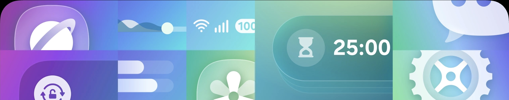

# Project Apex

Galaxy AI is here - Bring S-series Galaxy AI and smart One UI optimizations to supported Samsung devices — safely and reversibly.

---

### *Overview*

Project Apex is a Magisk module inspired by Aionix that adds advanced Galaxy AI from high-end S-series devices and performs advanced optimizations specifically for One UI, the same optimizations as [OneUI Enhancer](https://github.com/Llucs/oneui_enhancer)

Project Apex doesn't perform aggressive optimizations; it performs stable and reversible optimizations that improve your phone's fluidity without compromising stability

The module applies controlled device property overrides to unlock selected S-series features and Galaxy Store availability.

---

### *Compatibility*

Project Apex is compatible with Samsung devices running One UI 7, but may not function perfectly on some devices due to incompatibility with advanced features.

---

### *Installation*

> [!TIP]
> 1. Download the latest version from the releases tab  
> 2. Flash using Magisk  
> 3. Enjoy your fast device with advanced Galaxy AI!

---

### *Credits*

Based on **Aionix** by **Ali** (used with permission).
Project Apex is developed and maintained by **Llucs**.

---

### *Known bugs*

• Bixby doesn't listen to your voice; you can only chat via text within the app

• The AOD is a bit buggy, with automatic brightness enabled for some reason and sometimes elements of the AOD shifting slightly to the side

---

### What Project Apex does NOT do

- It does NOT overclock CPU or GPU
- It does NOT apply aggressive thermal or power hacks
- It does NOT modify kernel or boot images
- It does NOT guarantee all Galaxy AI features on all devices

---

### *LICENSE*

Licensed under the Project Apex Proprietary License.
See [LICENSE](https://github.com/Llucs/project_apex/blob/main/LICENSE) file for details.

(If you're wondering why the license isn't open source, the reason is that it includes apps and parts of the S25+ firmware, which are owned by Samsung, and since they're not mine, I can't make the project open source.)

*SpeedCool © 2025 — Made with ❤️ by @Llucs*